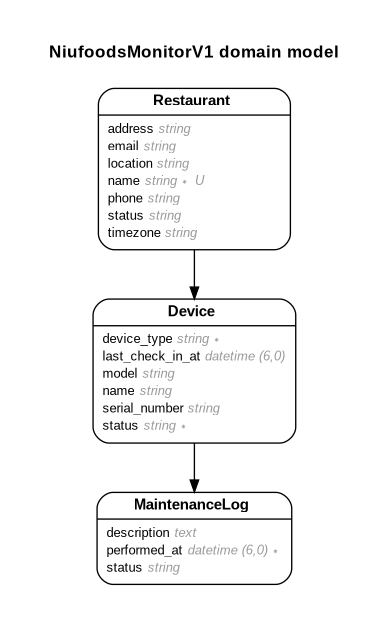
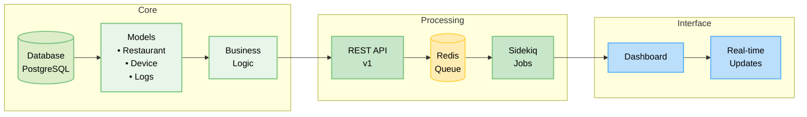

# NiuFoods Monitor v1

## 📋 Descripción del Proyecto

Sistema de monitoreo centralizado para dispositivos de hardware en restaurantes de la franquicia NiuFoods. La aplicación permite a los restaurantes reportar el estado de sus dispositivos (POS, impresoras, sistemas de red) a través de una API REST, procesando los datos en segundo plano con Sidekiq y almacenándolos en PostgreSQL.

## 🚀 Inicio Rápido con Docker (Recomendado)

La forma más fácil de ejecutar este proyecto es usando Docker. Solo necesitas tener Docker y Docker Compose instalados.

### Prerrequisitos
- Docker
- Docker Compose

### Instalación y Ejecución

#### 1. Clonar el repositorio
```bash
git clone <repository-url>
cd niufoods_monitor_v1
```

#### 2. Ejecutar setup completo (recomendado)
```bash
make setup
make simulator
```

#### O alternativamente:
```bash
./docker-setup.sh
docker compose --profile simulator up simulator
```


### Comandos Útiles

```bash
# Ver todos los comandos disponibles
make help

# Gestión de servicios
make start          # Iniciar servicios
make stop           # Detener servicios
make restart        # Reiniciar servicios
make logs           # Ver logs
make status         # Estado de servicios

# Desarrollo
make test           # Ejecutar pruebas
make simulator      # Iniciar simulador
make console        # Abrir consola de Rails

# Mantenimiento
make clean          # Limpiar contenedores y volúmenes
make reset          # Reset completo y setup
```

### Acceso a la Aplicación

Una vez iniciado, puedes acceder a:
- **Dashboard**: http://localhost:5000
- **API**: http://localhost:5000/api/v1
- **Sidekiq Dashboard**: http://localhost:5000/sidekiq

## 🏗️ Arquitectura del Sistema

```
[Simulador de Restaurantes] → HTTP → [API Rails] → Queue → [Sidekiq] → [Use Cases] → [PostgreSQL] → [Dashboard Web]
```

### Componentes Principales

- **API REST**: Endpoints para recibir actualizaciones de estado de dispositivos
- **Sidekiq**: Procesamiento asíncrono de actualizaciones de estado
- **PostgreSQL**: Base de datos principal
- **Dashboard Web**: Interfaz para visualizar el estado de restaurantes y dispositivos
- **Simulador**: Script que simula el comportamiento de restaurantes reales

## 🛠️ Tecnologías Utilizadas

- **Ruby**: 3.2.2
- **Rails**: 7.1.5
- **PostgreSQL**: Base de datos
- **Sidekiq**: Procesamiento en segundo plano
- **Redis**: Para Sidekiq
- **Puma**: Servidor web
- **Hotwire/Turbo**: Actualizaciones en tiempo real
- **Docker**: Containerización


## 📦 Instalación Manual (Sin Docker)

### Prerrequisitos

- Ruby 3.2.2 o superior
- PostgreSQL
- Redis
- Node.js (para assets)

### 1. Clonar el repositorio

```bash
git clone <repository-url>
cd niufoods_monitor_v1
```

### 2. Instalar dependencias

```bash
bundle install
```

### 3. Configurar variables de entorno

Copiar el archivo de ejemplo y configurar las variables:

```bash
cp env.example .env
```

Editar el archivo `.env` con tus credenciales:

```bash
# Database Configuration
DB_USERNAME=tu_usuario_postgres
DB_PASSWORD=tu_password_postgres

# Redis Configuration (para Sidekiq)
REDIS_URL=redis://localhost:6379/0

# Rails Configuration
RAILS_ENV=development
SECRET_KEY_BASE=tu_secret_key_base_aqui

# API Configuration (necesario para el simulador)
API_HOST=localhost
API_PORT=5000
```

**Nota**: El archivo `.env` ya está incluido en `.gitignore` para seguridad.

### 4. Configurar base de datos

```bash
# Crear base de datos
rails db:create

# Ejecutar migraciones
rails db:migrate

# Cargar datos de ejemplo
rails db:seed
```

### 5. Iniciar servicios

#### Opción 1: Usar Foreman (recomendado)
```bash
foreman start
```

#### Opción 2: Iniciar servicios por separado
```bash
# Terminal 1: Servidor web
rails server -p 5000

# Terminal 2: Sidekiq
bundle exec sidekiq -C config/sidekiq.yml

# Terminal 3: Redis (si no está corriendo)
redis-server
```

## 🚀 Uso del Sistema

### Dashboard Web

Acceder al dashboard principal:
```
http://localhost:5000
```

### API Endpoints

#### Actualizar estado de dispositivo
```bash
POST /api/v1/devices/status
Content-Type: application/json

{
  "device": {
    "serial_number": "POS001",
    "device_type": "pos",
    "name": "Terminal Principal",
    "model": "Verifone VX520",
    "status": "active",
    "description": "Dispositivo funcionando correctamente",
    "reported_at": "2024-01-15T10:30:00Z",
    "restaurant_name": "NiuFoods Centro"
  }
}
```

#### Obtener restaurantes (con dispositivos incluidos)
```bash
GET /api/v1/restaurants
```

**Respuesta incluye**: Lista de restaurantes con sus dispositivos asociados.

**Nota**: No existe el endpoint `/api/v1/restaurants/:id/devices`. Los dispositivos se incluyen automáticamente en la respuesta del endpoint de restaurantes.

### Simulador de Dispositivos

#### Con Docker:
```bash
make simulator
```

#### Sin Docker:
```bash
# Asegúrate de que las variables de entorno estén configuradas en .env
cd simulator
ruby device_simulator.rb
```

**Nota**: Para el simulador manual, asegúrate de que:
- El servidor web esté corriendo en `http://localhost:5000`
- Las variables `API_HOST=localhost` y `API_PORT=5000` estén en tu archivo `.env`
- La base de datos tenga datos de ejemplo (`rails db:seed`)

## 📊 Modelos de Datos

### Restaurant
- `name`: Nombre del restaurante
- `location`: Ubicación
- `status`: Estado general (operational, warning, issues)
- `address`, `email`, `phone`, `timezone`: Información de contacto

### Device
- `name`: Nombre del dispositivo
- `device_type`: Tipo (pos, printer, network)
- `status`: Estado (active, warning, critical, inactive)
- `serial_number`: Número de serie único
- `model`: Modelo del dispositivo
- `restaurant_id`: Referencia al restaurante
- `last_check_in_at`: Última verificación

### MaintenanceLog
- `device_id`: Referencia al dispositivo
- `description`: Descripción del mantenimiento
- `status_before`: Estado anterior
- `status_after`: Estado posterior
- `created_at`: Fecha de creación

## 🔄 Modelo de Dominio



El diagrama muestra las relaciones entre las entidades principales del sistema:

- **Restaurant**: Entidad central que representa un restaurante con sus datos de contacto y estado.
- **Device**: Representa los dispositivos asociados a un restaurante, con su información de estado y tipo.
- **MaintenanceLog**: Registra el historial de mantenimiento y cambios de estado de los dispositivos.

## 🔄 Flujo de Implementación

El siguiente diagrama muestra la arquitectura simplificada del sistema y el flujo de datos entre sus componentes principales:



El sistema se divide en tres áreas principales:

1. **Core**: Gestión de datos y lógica de negocio
   - Base de datos PostgreSQL
   - Modelos y validaciones
   - Lógica de negocio

2. **Processing**: Procesamiento de datos
   - API REST versión 1
   - Cola Redis para trabajos asíncronos
   - Jobs de Sidekiq

3. **Interface**: Interfaz de usuario
   - Dashboard de monitoreo
   - Actualizaciones en tiempo real

## 🧪 Testing

### Con Docker:
```bash
make test
```

### Sin Docker:
```bash
# Todas las pruebas
rails test
```

## 📁 Estructura del Proyecto

```
niufoods_monitor_v1/
├── app/
│   ├── controllers/api/v1/    # API controllers
│   ├── models/                # Modelos de datos
│   ├── jobs/                  # Jobs de Sidekiq
│   ├── usecases/              # Casos de uso
│   └── views/                 # Vistas del dashboard
├── simulator/                 # Script de simulación
├── config/
│   ├── sidekiq.yml           # Configuración de Sidekiq
│   └── database.yml          # Configuración de BD
├── docker-compose.yml        # Configuración de Docker
├── Dockerfile                # Imagen de Docker
├── Makefile                  # Comandos útiles
└── test/                     # Pruebas
```

## 🔧 Configuración Avanzada

### Docker
- Configuración en `docker-compose.yml`
- Imagen personalizada en `Dockerfile`
- Scripts de setup en `docker-setup.sh` y `Makefile`

### Sidekiq
- Configuración en `config/sidekiq.yml`
- Dashboard disponible en `http://localhost:5000/sidekiq`

### Base de Datos
- Configuración en `config/database.yml`
- Usar variables de entorno para credenciales

## 🚨 Solución de Problemas

### Docker
```bash
# Verificar estado de servicios
make status

# Ver logs
make logs

# Reiniciar servicios
make restart

# Reset completo
make reset
```

## 📝 Notas de Desarrollo

- El sistema utiliza procesamiento asíncrono para manejar actualizaciones de estado
- Los cambios de estado se registran automáticamente en el log de mantenimiento
- El estado del restaurante se calcula automáticamente basado en el estado de sus dispositivos
- Docker proporciona un entorno aislado y reproducible

## 📄 Licencia

Este proyecto es parte del desafío técnico de NiuFoods.